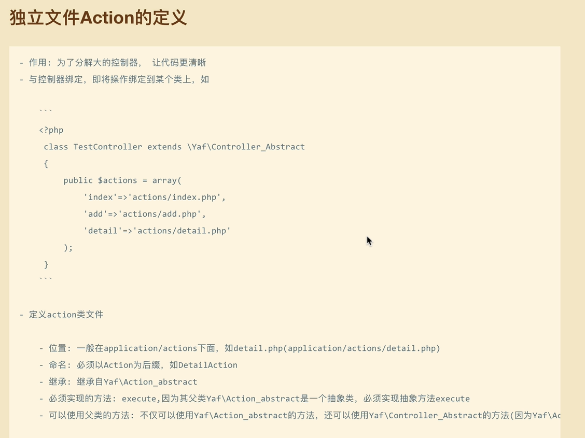

### action函数的参数会自动获取路径上的参数
```php
public function testAction($uid)
{
    //http://localhost/user/test/uid/1
    var_dump($uid == $this->getRequest()->getParam('uid')); //true
}
```
### 控制器中独立Action文件的定义

### 控制器跳转方法
```php
public function testAction()
{
    //跳转到user控制器下的login方法
    $this->redirect('/user/login');//会改变URL路径
    $this->forward('login',['uid'=>1]);//不会改变URL路径,可以带参数
}

public function loginAction()
{
    //只能通过getParam获取forward传过来的参数
    echo 'login:' . $this->getRequest()->getParam('uid');
}

```