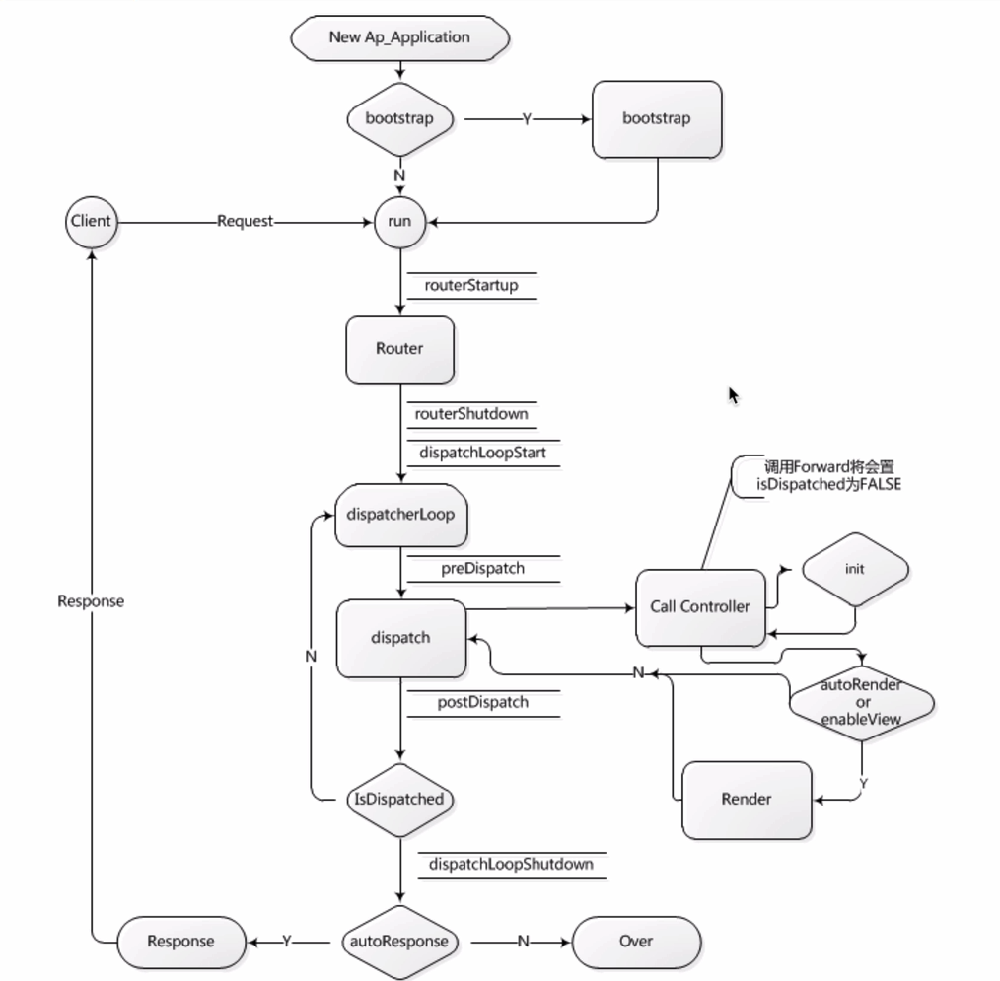

### 构建基本框架目录
`composer create-project phpcasts/yaf-skeleton yaf-demo dev-master --repository-url https://packagist.phpcomposer.com -vvv`
### 运行: 
`php.exe -S localhost:8080 demo/index.php`
### 浏览器打开localhost:8080报错：'Yaf_Application' not found
`原因：php.ini未配置yaf扩展`
### 运行流程

### bootstrap.php 中的 '_init'开头的方法会依次自动调用