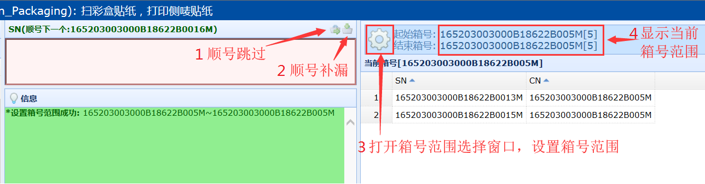
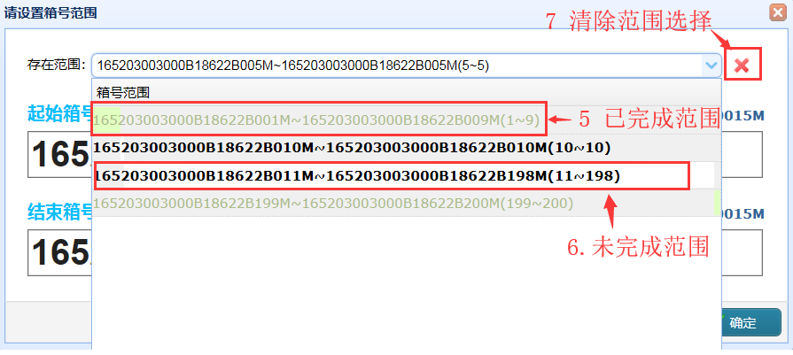
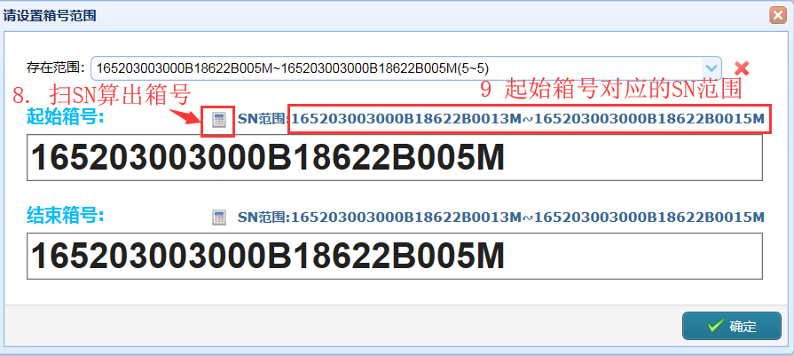
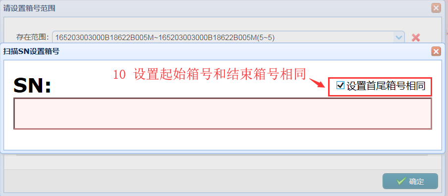

### CN范围功能图示(SN范围、PLN范围与此类似)

1.	顺号跳过。顺序装箱，因不良等原因不能装箱时点击该按钮可顺号跳过。
2.	顺号补漏。顺序装箱，且存在跳号的SN时可点击该按钮，将顺号跳过的产品补插进去。
3.	打开箱号范围选择窗口。
4.	显示当前选择的箱号范围。
5.	浅绿色字体的范围表示已完成，绿色背景表示当前行表示的范围占总范围的比例。
6.	黑色加粗字体表示未完成范围，白色背景表示当前行范围占总范围的比例。
7.	重置范围选择，将范围设置为默认范围(即最大范围)。
8.	打开扫描SN设置箱号窗口。(顺序装箱时可用)
9.	显示起始箱号的SN范围。(顺序装箱时可用)
10.	扫描SN之前勾选，将会设置起始和结束箱号都为扫描的SN对应的箱号。(顺序装箱时可用)
